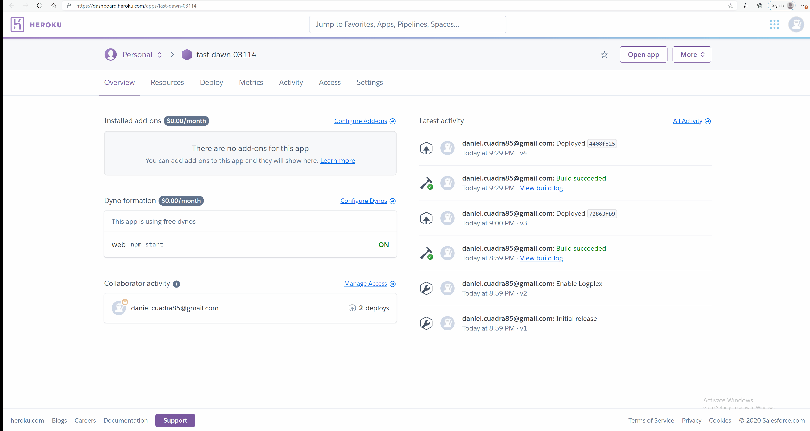

# 10-Express Server Note Taker

This program passes through a local server using Express and node.js. This program will allow you to create, save, and load past notes.

* Use of JavaScript.
* Use of Express.
* Use of Node.Js.
* Use of HTML.
* Use of CSS.

## Installation

If you are going to run this locally on your system, and not on Heroku, you will first need to make sure you have Node.JS installed within your Visual Studio Code application. The next step would be to right click the Develop folder and select "Open in Integrated Terminal". When your terminal opens, type the command "npm install". Once the dependencies have installed, type the command "node app.js" to start the program.

## Usage

This page's function was created through Express, with JavaScript and Node.js. Go to [Heroku](https://dashboard.heroku.com/apps/fast-dawn-03114) and click "Open App" to start the program. This will load the Note Taker home page. Click the "Get Started" button to begin using the note taker. Click the pencil on the top right of the screen to create a new note and then click the save button that appears at the top right to save your notes. After you click save, you will be able to reload any notes you took from the list on the left side of the screen.



## Code

Write Function Utilizing Read/Write:

```
app.post("/api/notes", function (req, res) {
    const numberID = Math.floor((Math.random() * 100))
    const noteBody =
    {
        id: numberID,
        title: req.body.title,
        text: req.body.text,
    };
    // console.log(noteBody);

    fs.readFile("db.json", "utf8", function (err, data) {
        if (err) {
            console.log("Error:" + err);
        }
        const mainNote = JSON.parse(data);
        // console.log("mainNote" + mainNote)
        mainNote.push(noteBody);
        // console.log("notes:" + JSON.stringify(mainNote));

        fs.writeFile("db.json", JSON.stringify(mainNote, null, 2), function (err) {
            if (err) {
                console.log("Error:" + err);
            }
            else {
                res.json(mainNote);
                console.log("Note saved.");
            }
        });
    });
});;
```

Delete Function Code Utilizing Read/Write:

```
app.delete("/api/notes/:id", function (req, res) {
    fs.readFile("db.json", "utf8", function (err, data) {
        if (err) {
            return console.log("Error:" + err);
        }
        const findNote = JSON.parse(data)
        console.log("locate statement")

        findNote.forEach(element => {
            if (element.id == req.params.id) {
                findNote.splice(element, 1);
                console.log("splice element")
            }
            console.log("nothing else to delete")
        });

        fs.writeFile("db.json", JSON.stringify(findNote, null, 2), function (err) {
            if (err) {
                console.log("Error:" + err);
            }
            res.json(db);
            console.log("note deleted");
        })
    })
})
```


## Credits

* https://github.com/coding-boot-camp/
* https://stackoverflow.com/questions/
* https://guides.github.com/features/mastering-markdown/
* https://www.npmjs.com/

## Built With

* [HTML](https://developer.mozilla.org/en-US/docs/Web/HTML)
* [JavaScript](https://developer.mozilla.org/en-US/docs/Web/JavaScript)

## Deployed Link

* https://dashboard.heroku.com/apps/fast-dawn-03114


## Authors

* **Daniel Cuadra** 

- [GitHub](https://github.com/DCuadra85)
- [LinkedIn](https://www.linkedin.com/in/daniel-cuadra-3705aa39/)


## License

MIT License

Copyright (c) [2020] [DanielCuadra]

Permission is hereby granted, free of charge, to any person obtaining a copy
of this software and associated documentation files (the "Software"), to deal
in the Software without restriction, including without limitation the rights
to use, copy, modify, merge, publish, distribute, sublicense, and/or sell
copies of the Software, and to permit persons to whom the Software is
furnished to do so, subject to the following conditions:

The above copyright notice and this permission notice shall be included in all
copies or substantial portions of the Software.

THE SOFTWARE IS PROVIDED "AS IS", WITHOUT WARRANTY OF ANY KIND, EXPRESS OR
IMPLIED, INCLUDING BUT NOT LIMITED TO THE WARRANTIES OF MERCHANTABILITY,
FITNESS FOR A PARTICULAR PURPOSE AND NONINFRINGEMENT. IN NO EVENT SHALL THE
AUTHORS OR COPYRIGHT HOLDERS BE LIABLE FOR ANY CLAIM, DAMAGES OR OTHER
LIABILITY, WHETHER IN AN ACTION OF CONTRACT, TORT OR OTHERWISE, ARISING FROM,
OUT OF OR IN CONNECTION WITH THE SOFTWARE OR THE USE OR OTHER DEALINGS IN THE
SOFTWARE.